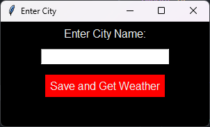
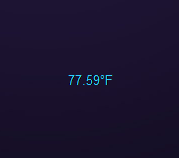

# Weather App

A lightweight desktop weather application that displays current temperature in a small, movable window with system tray integration.




## Features

- **Minimalist Display**: Small, transparent window showing temperature
- **Always on Top**: Stays visible above other applications
- **Draggable**: Move the display anywhere on your screen
- **System Tray Integration**: Access controls from the system tray
- **Auto-refresh**: Updates every 30 minutes automatically
- **Position Memory**: Remembers window position between sessions
- **Rain Indicator**: Shows raindrop icon when it's raining
- **Temperature Colors**: 
  - Blue for ≤70°F
  - Orange for 80-89°F  
  - Red for ≥90°F

## Installation

### Prerequisites

- Python 3.7 or higher
- pip (Python package installer)

### Required Packages

```bash
pip install pystray pillow requests tkinter
```

### Setup

1. Clone this repository:
```bash
git clone https://github.com/yourusername/weather-app.git
cd weather-app
```

2. Get an API key from [OpenWeatherMap](https://openweathermap.org/api):
   - Sign up for a free account
   - Generate an API key

3. Edit `TempRain.py` and replace the API key:
```python
API_KEY = 'your_api_key_here'
```

4. Run the application:
```bash
python TempRain.py
```

Or for silent background execution:
```bash
pythonw TempRain.py
```

## Usage

### First Run
- The app will prompt you to enter your city name
- This is saved and remembered for future runs

### Controls
- **Left-click and drag**: Move the temperature display
- **Right-click**: Hide the temperature display
- **System tray menu**:
  - Show Weather: Restore hidden display
  - Change City: Update location
  - Refresh Now: Force weather update
  - Exit: Close application

### File Structure
```
WeatherApp/
├── TempRain.py          # Main application
├── WeatherApp.pyw       # Silent launcher (no console)
├── run_weather.bat      # Windows batch launcher
├── README.md            # This file
├── LICENSE              # License file
├── requirements.txt     # Python dependencies
├── assets/              # Assets folder
│   ├── weatherAppIcon.png
│   ├── raindrop.png
│   └── screenshot.png
├── city.txt             # Saved city (auto-generated)
└── window_position.json # Saved position (auto-generated)
```

## Configuration

### Update Interval
Change the refresh frequency by modifying `UPDATE_INTERVAL` in `TempRain.py`:
```python
UPDATE_INTERVAL = 1800000  # 30 minutes in milliseconds
```

### Temperature Colors
Customize temperature color thresholds in the `update_weather_info()` function.

## Troubleshooting

### Common Issues

1. **System tray icon not appearing**:
   - Ensure `pystray` is installed: `pip install pystray`
   - Check that your system supports system tray icons

2. **API errors**:
   - Verify your API key is correct
   - Ensure you have internet connectivity
   - Check API usage limits

3. **Temperature display disappears**:
   - Use system tray menu to show the display
   - Check `weather_app_error.log` for error details

### Error Logs
The app creates error logs for troubleshooting:
- `weather_app_error.log` - Main application errors
- `startup_error.log` - Startup and dependency errors

## Development

### Running in Development Mode
```bash
python TempRain.py
```

### Building for Distribution
For Windows executable:
```bash
pip install pyinstaller
pyinstaller --onefile --windowed TempRain.py
```

## Contributing

1. Fork the repository
2. Create a feature branch (`git checkout -b feature/amazing-feature`)
3. Commit your changes (`git commit -m 'Add amazing feature'`)
4. Push to the branch (`git push origin feature/amazing-feature`)
5. Open a Pull Request

## License

This project is licensed under the MIT License - see the [LICENSE](LICENSE) file for details.

## Acknowledgments

- Weather data provided by [OpenWeatherMap](https://openweathermap.org/)
- System tray functionality powered by [pystray](https://github.com/moses-palmer/pystray)
- GUI built with Python's tkinter

## API Usage Notice

This application uses the OpenWeatherMap API. Please ensure you comply with their [terms of service](https://openweathermap.org/terms) and usage limits.